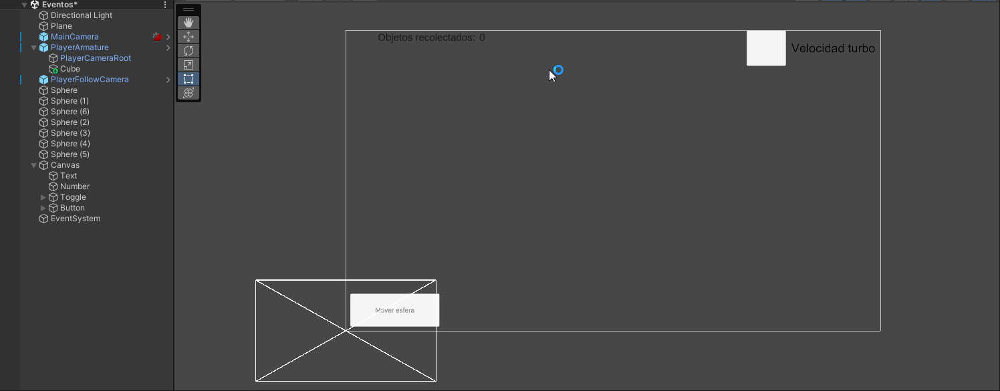
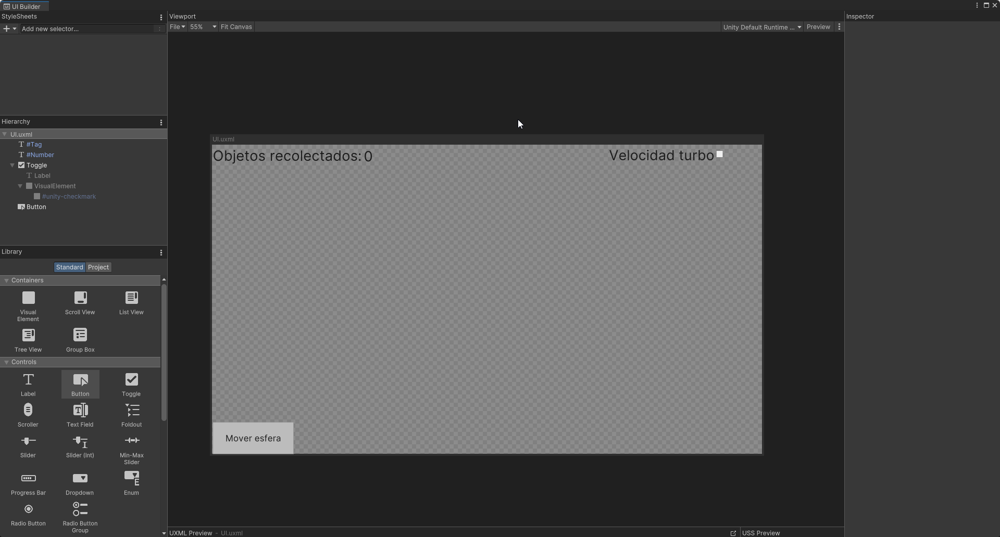

# Fundamentos del desarrollo de videojuegos
### Diego Herrera Mendoza
Eventos

Antes de realizar los ejercicios, se ha tenido que en cuenta que hay varios tipos de herramientas para la UI en Unity. En este caso se han utilizado 2, la herramienta por defecto y la UI Tool Kit.

### UI por defecto

### UI Tool Kit

1. Implementar una UI que permita configurar con qué velocidad te moverás: turbo o normal. También debe mostar la cantidad de objetos recolectados y si chocas con alguno especial restar fuerza.

- Script para UI por defecto: [Ejercicio1-1](scripts/Ejercicio1-Player.cs)
- Script para UI Tool Kit: [Ejercicio1-1](scripts/Ejercicio1-Player-TK.cs)
- Script para objetos: [Ejercicio1-2](scripts/Ejercicio1-Ball.cs)
---
2. Agrega un personaje que al clickar sobre un botón de la UI se dirija hacia un objetivo estático en la escena.

- Script para botón: [Ejercicio2](scripts/Ejercicio2.cs)
- Script para botón UI Tool Kit: [Ejercicio2](scripts/Ejercicio2-TK.cs)
---
3. Agregar a tu escena un objeto que al ser recolectado por el jugador haga que otros dos objetos en la escena realicen las siguientes acciones: el objeto A se desplaza hacia el jugador. El objeto B se ubica en un punto fijo en la escena.

- Script para seguimiento: [Ejercicio3-2](scripts/Follow.cs)
- Script para objeto: [Ejercicio3-3](scripts/Ejercicio3.cs)
---

Mismo funcionamiento con UI Tool Kit:

